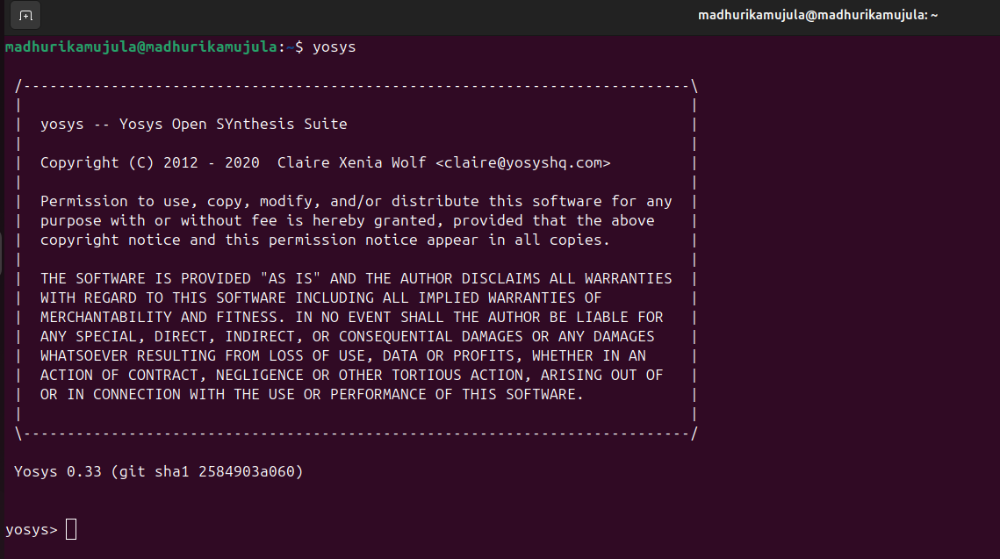
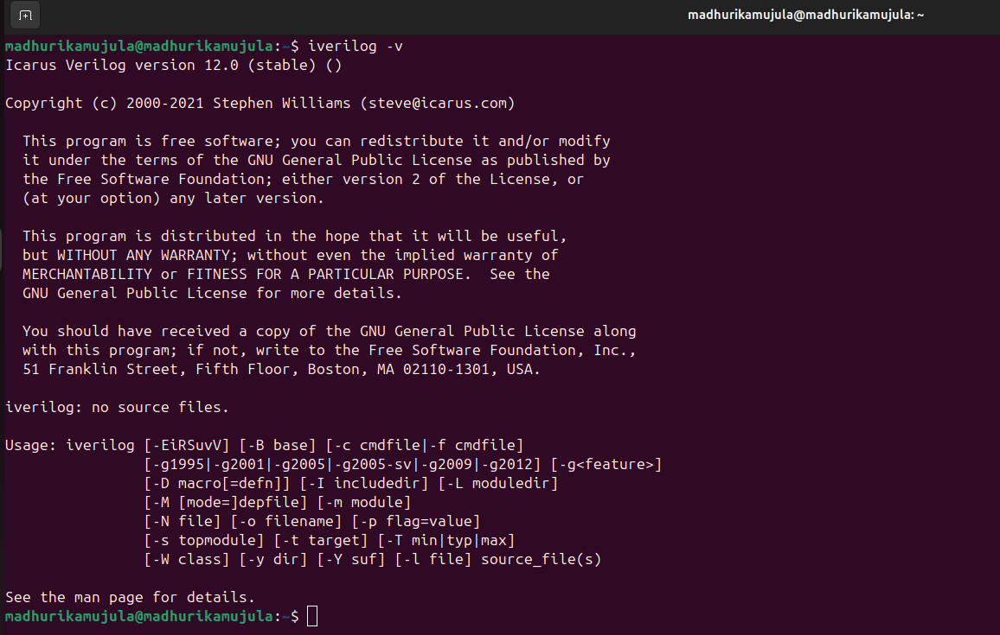
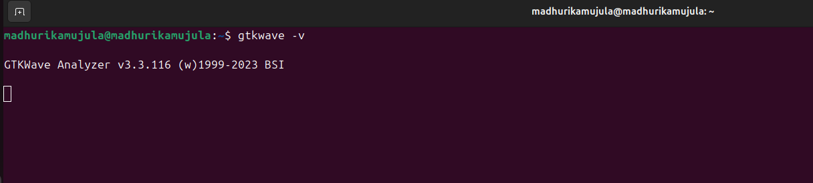

### RISC-V Reference SoC Tapeout Program VSD

### 🛠️ Tools Installation Guide

### All required tools for this program can be installed by following the instructions below.

### ✅ System Requirements

Make sure your system meets the following minimum specifications:

Resource and Requirement

🧠 RAM - 6 GB or more

💽 Storage - 50 GB HDD (free space)

💻 OS - Ubuntu 20.04 or higher

⚙️ CPU - 4 vCPUs

### TOOL CHECK

### Yosys

```
$ sudo apt-get update 

$ git clone https://github.com/YosysHQ/yosys.git 

$ cd yosys 

$ sudo apt install make (If make is not installed please install it)  

$ sudo apt-get install build-essential clang bison flex \ 
libreadline-dev gawk tcl-dev libffi-dev git \ 
graphviz xdot pkg-config python3 libboost-system-dev \ 
libboost-python-dev libboost-filesystem-dev zlib1g-dev 

$ make config-gcc 

$ make  

$ sudo make install
```


### IVERILOG

```
 $ sudo apt-get update 

$ sudo apt-get install iverilog
 ```


### GTKWAVE
 
```
 $ sudo apt-get update 

$ sudo apt install gtkwave
 ```

